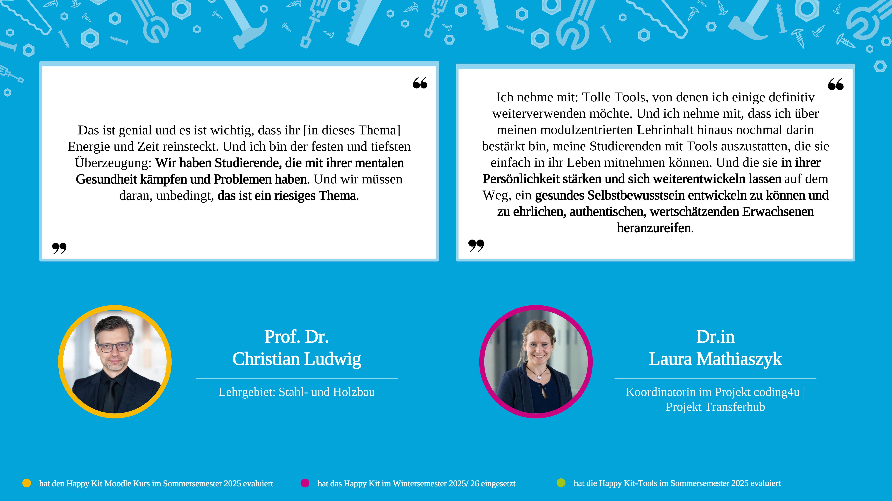
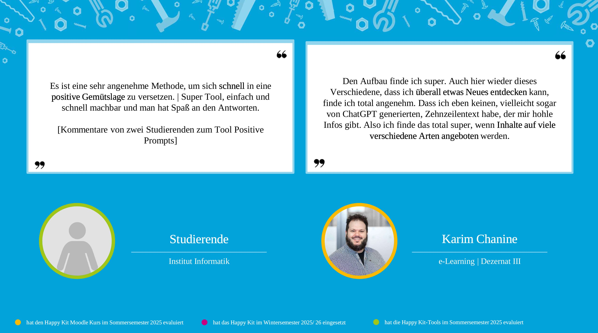
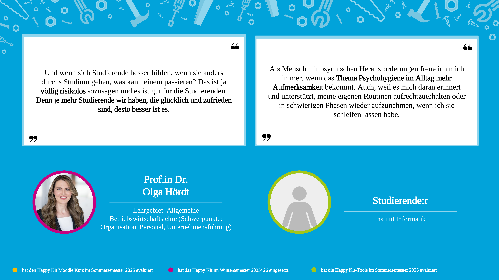

<!-- Diese Datei wird von build.py erzeugt. Nicht direkt bearbeiten -- stattdessen die Fragmente in src/. -->

<!--
author:   Maike Graf, Carolin Straßmann, Julia Lingnau, Lucas Lichner
email:    happykit@hs-ruhrwest.de
version:  0.2.0
language: de
narrator: Deutsch Female

comment:  Ein digitaler Werkzeugkoffer zur Steigerung des psychischen
          Wohlbefindens von Studierenden im Rahmen der Lehre.

@style
.lia-toc__link--active { font-weight: 700; }
details { margin: .6rem 0; padding: .6rem .9rem; border-left: 4px solid #c7017f;
          background: rgba(199,1,127,.06); border-radius: 4px; }
details > summary { cursor: pointer; }
blockquote { border-left: 4px solid #c7017f; }
@end
-->

<!-- Bewusst KEIN license:-Feld im Kopf: die Rechteklärung läuft noch. Erst
     eintragen, wenn das Lizenzaudit abgeschlossen ist (siehe LICENSE). -->

<!-- ACHTUNG: Dieser Badge funktioniert erst, wenn das Repository öffentlich
     ist. LiaScript rendert clientseitig und braucht dafür eine öffentlich
     abrufbare raw-URL; bei einem privaten Repository verlangt
     raw.githubusercontent.com ein Token und der Kurs bleibt leer.
     Solange das Repository privat ist: `python tools/serve.py`. -->

# Happy Kit 2.0

> **Ein digitaler Werkzeugkoffer zur Steigerung des psychischen Wohlbefindens
> von Studierenden im Rahmen der Lehre**
>
> Hochschule Ruhr West · angestrebte Lizenz CC BY-SA 4.0
> (Rechteklärung läuft, siehe `LICENSE`)

Liebe Lehrende,

wir freuen uns, dass du dich gemeinsam mit uns auf den Weg machst, das Thema
mentale Gesundheit von Studierenden anzugehen. Das Happy Kit versammelt
erprobte Werkzeuge, die sich ohne großen Aufwand in bestehende
Lehrveranstaltungen einbauen lassen.

Die Werkzeuge sind nach dem **PERMA-Modell** von Martin Seligman geordnet — den
fünf Bausteinen des Wohlbefindens:

| Baustein | | Worum es geht |
|---|---|---|
| **P** | Positive Emotions | Positives bewusst wahrnehmen |
| **E** | Engagement | Stärken kennen und einsetzen |
| **R** | Relationships | Tragfähige Beziehungen gestalten |
| **M** | Meaning | Sinn und Werte klären |
| **A** | Accomplishment | Erfolge sichtbar machen |

Dazu kommen **Check-in-Werkzeuge** für einen aktivierenden Start und eine
positive Atmosphäre.

Jedes Werkzeug ist gleich aufgebaut: eine Kurzbeschreibung, eine
Schritt-für-Schritt-Anleitung, Tipps aus der Praxis, die Evidenzlage und
Literatur zum Weiterlesen — dazu die Materialien zum Download.

> ⚠️ **Hinweis zu dieser Fassung.** Übertragen sind alle öffentlichen
> Abschnitte des Moodle-Kurses mit 19 Werkzeugen. Nicht enthalten sind die
> Lehrenden-Ratings und Feedback-Formulare — eine statische Seite kann keine
> Daten erheben — sowie der interne Admin-Abschnitt. Die Rechteklärung für die
> Materialien läuft noch; Einzelheiten in `docs/KONVERTIERUNG.md` und `LICENSE`.

## Herzlich Willkommen im Moodle-Kurs zum "Happy Kit"!

Liebe Lehrende,

wir, das Team hinter „Happy Kit", freuen uns sehr, dich in diesem Moodle-Kurs begrüßen zu dürfen und darüber, dass du dich gemeinsam mit uns auf den Weg machst, das Thema mentale Gesundheit von Studierenden an der HRW anzugehen. **Du leistest damit einen wichtigen Beitrag!**

Schau dir die **kurze Videoanleitung zur Nutzung dieses Moodle-Kurses** an, die dir die wichtigsten Informationen für einen Schnellstart liefert. Danach kannst du mithilfe unseres **Inhaltsverzeichnisses weiter unten die verschiedenen Bereiche erkunden**.

Viel Spaß dabei!

*(Video, siehe `docs/GROSSE-DATEIEN.md`)* Dein Browser kann dieses Video nicht abspielen. Video herunterladen

## Testimonials

### Testimonials Slider

## P - Positive Emotions

Tools zur Förderung des Erlebens von positiven Emotionen

Das Erleben positiver Emotionen wie Freude, Dankbarkeit, Stolz, Optimismus oder Hoffnung trägt selbstverständlich zu unserem Wohlbefinden bei und kann helfen, motiviert zu bleiben. Allerdings lässt uns der sogenannte "Negativitäts-Bias" negative Emotionen deutlich intensiver erleben, sodass es das Erleben von drei positiven Emotionen braucht, um eine negative auszugleichen. Unterstützt die Studierenden dabei, sich auf das Positive in ihrem Leben zu fokussieren und dieses bewusst wahrzunehmen.

In diesem Abschnitt findest du folgende Werkzeuge:

- [Positive Prompts](#positive-prompts)
- [Three Good Things](#three-good-things)

### Positive Prompts

> ⏰ 5–10 Minuten — 👤 Einzelarbeit — 🕑 Flexibler Zeitpunkt innerhalb der Veranstaltung — 🔁 wiederkehrender Einsatz — 🤸 Aktivierend | 🪞 Reflektierend

#### Kurzbeschreibung
Positive Prompts sind Fragen aus der Positiven Psychologie, die sich auf positive Ereignisse oder Momente in der Vergangenheit beziehen. Durch das Wiedererleben der damit verbundenen positiven Emotionen kann bei regelmäßiger Beantwortung das Wohlbefinden gesteigert werden. Die Prompts können ideal zu **Beginn einer Veranstaltung** als Einstieg genutzt werden, um eine positive Atmosphäre zu kreieren, **oder als kleine Pause** zwischendurch.

Wir haben insgesamt **15 Positive Prompts** für euch vorausgewählt, sodass theoretisch jede Semesterwoche mit einem Prompt gefüllt werden kann; die Frequenz und Reihenfolge des Einsatzes bestimmt ihr.

Zusätzlich stellen wir euch eine englische Variante der Positive Prompts und eine **Prompt-"Blaupause"** zur Verfügung, in die ihr eure eigenen Prompts einfügen könnt, um die Passung zu euren Modulinhalten und -aktivitäten zu erhöhen.

<b>Schritt-für-Schritt Anleitung</b>

**Schritt 1**: Sucht euch in Vorbereitung auf eure Lehrveranstaltung einen Positive Prompt (bestehend aus 2 Folien) aus dem vorbereiteten Foliensatz aus. Ihr könnt die Positive Prompts der Reihenfolge nach verwenden oder nach eurem Belieben. Eine englische Variante findet ihr im Download-Verzeichnis unten.

**Schritt 2**: Kopiert die ausgewählten Folien in euren eigenen Foliensatz.

**Schritt 3**: Gebt den Studierenden am Anfang der Veranstaltung 5 Minuten Zeit, um den Positive Prompt schriftlich zu beantworten. Ideen dazu, was ihr zur Anleitung sagen könnt, findet ihr in den Notizen der PowerPoint-Folien. Auf der zweiten Folie zum Prompt findet ihr außerdem Leitfragen, die ihr den Studierenden mitgeben könnt.

**Schritt 4** (optional): Fragt nach der Bearbeitung, ob jemand etwas mit der Gruppe teilen möchte.

<b>Tipps & Best Practice</b>

1. Es kann für die Motivation hilfreich sein, wenn ihr als **Lehrende den Prompt ebenfalls in der Zeit für euch bearbeitet** und so nochmal deutlicher als Vorbild fungiert.
2. Macht deutlich, dass Studierende **nicht teilen müssen, was sie aufgeschrieben haben**. Sie müssen ihre Antwort nicht im Plenum vorstellen oder später abgeben. Ihr könnt nach der Bearbeitung aber natürlich fragen, ob jemand etwas mit der Gruppe teilen möchte.
3. Es hat sich gezeigt, dass die Positive Prompts am effektivsten sind, wenn sie **schriftlich** (auf Papier oder digital) bearbeitet werden. Die Studierenden sollten vor allem beim ersten Einsatz der Positive Prompts dazu explizit animiert werden.
4. Falls ihr vorhabt, weitere Positive Prompts über den Semesterverlauf zu verwenden, könnt ihr die Studierenden **ermutigen, ein eigenes kleines Portfolio** anzulegen, in dem sie ihre Antworten auf die Positive Prompts über das Semester hinweg sammeln.

Best Practice-Beispiel einer Lehrenden:

*„Und nachdem ich meinen geteilt hatte, habe ich darauf Reaktionen bekommen. Entweder auf mein geteiltes Erlebnis oder die Studierenden haben dann ihren eigenen auch geteilt. Und dann war so ein ganz ausgelassenes, einfach ein gelöstes Miteinander.“*

<b>Warum und wie das wirkt</b>

Positive Emotionen können im Studienalltag wichtige Ressourcen aktivieren. Forschungsergebnisse zeigen, dass sie Aufmerksamkeit, Offenheit und kreatives Denken fördern und dadurch Lern- und Problemlöseprozesse unterstützen können. Die Broaden-and-Build-Theorie (Fredrickson, 2001) beschreibt, dass positive Emotionen den Denk- und Handlungsspielraum erweitern, z.B. indem sie Kreativität und Neugier hervorrufen, und langfristig persönliche Ressourcen wie soziale Kompetenzen, Resilienz und Selbstwirksamkeit aufbauen (Fredrickson, 2013).

Positive Prompts, die Studierende an gelungene, motivierende oder schöne Erfahrungen erinnern, können dazu beitragen, positive Emotionen erneut zu aktivieren und einen konstruktiveren Blick auf Herausforderungen im Studium zu fördern (Lyubomirsky, King, & Diener, 2005). Studien weisen außerdem darauf hin, dass positive Emotionen den Umgang mit Stress erleichtern und adaptive Bewältigungsstrategien unterstützen können (Tugade & Fredrickson, 2004).

<b>Literatur für Neugierige</b>

- Fredrickson, B. L. (2001). The role of positive emotions in positive psychology: The broaden-and-build theory of positive emotions. *American Psychologist, 56*(3), 218–226. [https://doi.org/10.1037/0003-066X.56.3.218](https://psycnet.apa.org/doi/10.1037/0003-066X.56.3.218)
- Fredrickson, B. L. (2013). Positive emotions broaden and build. In *Advances in experimental social psychology* (Vol. 47, pp. 1-53). Academic Press. [https://doi.org/10.1016/B978-0-12-407236-7.00001-2](https://doi.org/10.1016/B978-0-12-407236-7.00001-2)
- Lyubomirsky, S., King, L., & Diener, E. (2005). The Benefits of Frequent Positive Affect: Does Happiness Lead to Success? *Psychological Bulletin, 131*(6), 803–855. [https://doi.org/10.1037/0033-2909.131.6.803](https://psycnet.apa.org/doi/10.1037/0033-2909.131.6.803)
- Tugade, M. M., & Fredrickson, B. L. (2004). Resilient Individuals Use Positive Emotions to Bounce Back From Negative Emotional Experiences. *Journal of Personality and Social Psychology, 86*(2), 320–333. [https://doi.org/10.1037/0022-3514.86.2.320](https://psycnet.apa.org/doi/10.1037/0022-3514.86.2.320)

#### Material zum Download

- [Happy Kit_Anleitung Positive Prompts.pdf](downloads/happy-kit-anleitung-positive-prompts.pdf) — 0.2 MB
- [Happy Kit_Positive Prompts_Blaupause.pptx](downloads/happy-kit-positive-prompts-blaupause.pptx) — 1.6 MB
- Happy Kit_Positive Prompts_Foliensatz.pptx — 33.8 MB *(zu gross fuer das Repository, siehe docs/GROSSE-DATEIEN.md)*
- Happy Kit_Positive Prompts_Foliensatz_engl.pptx — 33.8 MB *(zu gross fuer das Repository, siehe docs/GROSSE-DATEIEN.md)*

### Three Good Things

> ⏰ 5–10 Minuten — 👤 Einzelarbeit — 🕑 Am Ende der Veranstaltung — 🔁 wiederkehrender Einsatz — 🪞 Reflektierend

#### Kurzbeschreibung
Das Tool „Three Good Things“ ist eine klassische **Dankbarkeitsintervention aus der Positiven Psychologie**, die auch im Hochschulkontext angewendet werden kann. Mithilfe dieses Tools, das **als Wooclap-Umfrage** aufbereitet ist, soll über positive Aspekte und gelungene Momente der Veranstaltung reflektiert werden, um die positive Emotion der Dankbarkeit bei Studierenden zu fördern. Das Tool kann ideal **zum Ende einer Veranstaltung** genutzt werden, um einen positiven Abschluss der Veranstaltung zu ermöglichen. Es werden **ca. 5 Minuten** für den Einsatz benötigt.

Diese Art von Übung kann jede Woche durchgeführt werden. Wer **alternative Fragen** verwenden möchte, die sich ebenfalls auf die Veranstaltung oder den Hochschulkontext allgemein beziehen und positive Emotionen fördern können, findet Vorschläge im pdf-Dokument "Happy Kit_Three Good Things_Alternativen".

<b>Schritt-für-Schritt Anleitung</b>

**Schritt 1**: Kopiert euch die [PowerPoint-Folien](downloads/happy-kit-three-good-things-folien.pptx) in euren eigenen Foliensatz.

**Schritt 2**: Für dieses Tool ist die (unkomplizierte) Nutzung von Wooclap vorgesehen. **Wenn ihr noch nicht viel Erfahrung mit Wooclap habt, findet ihr in** [**"Fahrpläne und Anleitungen"**](https://elearning.hs-ruhrwest.de/mod/folder/view.php?id=634498) **eine ausführliche Erklärung.** 
Die Kurzfassung: Geht auf [Wooclap in den Vorlagenbereich der HRW](https://app.wooclap.com/home/templates). Dort findet ihr bereits die **Vorlage „Happy Kit_Three Good Things“**. Klickt auf „Vorlage verwenden“; die Umfrage ist nun in eurem Eventbereich zu finden und hat einen neuen Code erhalten, sodass sie unabhängig von der ursprünglichen Vorlage verwendet werden kann.

**Schritt 3**: Es ist möglich, die Wooclap-Umfrage direkt in euren Foliensatz einzubetten. Dazu müsst ihr zuvor **Wooclap als Add-in in PowerPoint** hinzufügen.
**Klickanleitung**: Geht auf die zweite Folie des vorbereiteten Foliensatzes und klickt oben im Reiter auf „Einfügen“ --> „Add-Ins“ --> „“Meine Add-Ins“ --> „Store“ + Wooclap eingeben --> „Hinzufügen“ + HRW Login-Daten eingeben.
Wooclap öffnet sich auf der PowerPoint-Folie und ihr könnt die Umfrage aus eurem Eventbereich anklicken.

**Schritt 4**: Teilt die Frage „Für welche drei Dinge im Rahmen der heutigen Veranstaltung sind Sie dankbar?“ auf der ersten PowerPoint-Folie mit den Studierenden. Bittet sie, auf Wooclap zu gehen und teilt dann den Umfragen-Code mit ihnen, der auf der zweiten Folie angezeigt wird. Ideen dazu, was ihr zur Anleitung sagen könnt, findet ihr in den Notizen der PowerPoint-Folie.

**Schritt 5**: Gebt den Studierenden 3 Minuten zur Beantwortung der Frage. Nach kurzer Zeit müssten die Eingaben der Studierenden auf der PowerPoint-Folie interaktiv erscheinen.

**Schritt 6**: Greift einzelne Antworten auf, um so die verschiedenen positiven Aspekte hervorzuheben und die Studierenden mit diesem Gefühl aus der Veranstaltung zu entlassen.

<b>Tipps & Best Practice</b>

1. Stellt vorab ein, dass die **Antworten in Wooclap als Wortliste** angezeigt werden (Wortwolken sind leider zu unübersichtlich).
2. Macht deutlich, dass die Umfrage **anonym** ist.
3. Es kann hilfreich sein, ein **Beispiel** zu geben für etwas, für das man dankbar sein kann (eine verwendete Methode, ein nettes Gespräch mit Kommiliton:innen, der Kaffee auf dem Weg zur Veranstaltung).
4. Das Tool kann für euch auch eine Art Zusammenfassung oder Feedback darstellen, im Vordergrund soll aber die **„geteilte“ Dankbarkeit** bzw. der **Fokus auf dem Positiven** am Ende der Veranstaltung stehen. Studierende können so voneinander lernen, was positiv gelaufen ist und wofür man dankbar sein kann.
5. Je nach Studierendengruppe kann es ratsam sein, die Antworten nicht sofort, sondern **erst nach 3-5 Minuten zu zeigen**. So können die Studierenden einen Moment in Ruhe reflektieren und es wird vermieden, dass die Antworten der Kommiliton:innen die eigene Wahrnehmung beeinflussen.
6. Um ein "Fishing for compliments" zu vermeiden, kann explizit darauf hingewiesen werden, dass es sich bei der Übung **nicht um Feedback an die Lehrperson** handelt, sondern um eine allgemeinere Reflexion der Veranstaltung.

Best Practice-Beispiel einer Lehrenden:

*„Aber da waren so ein paar dabei, die haben mich auch echt berührt, wo ich dachte, ja, das tut einem auch gut, dann zu sehen, wofür andere Leute dankbar sein können, um erstmal zu sehen, wie viel mehr da eigentlich sein könnte für einen auch selbst. Schön."*

<b>Warum und wie wirkt das</b>

Dankbarkeitsinterventionen wie „Three Good Things" basieren auf einem gut untersuchten Interventionsprinzip. So konnten Seligman et al. (2005) zeigen, dass das tägliche Aufschreiben von drei guten Dingen über einen Zeitraum von einer Woche **das Wohlbefinden signifikant steigerte und depressive Symptome bis zu sechs Monate nach der Intervention reduzierte.** Weiterhin geht das regelmäßige Erleben von Dankbarkeit mit **höherer Lebenszufriedenheit, reduziertem Stress und besseren sozialen Beziehungen** einher (Emmons & McCullough, 2003).

Im Bildungskontext zeigen Studien, dass Dankbarkeitsübungen das **akademische Engagement und die Zufriedenheit von Studierenden fördern** können (Flinchbaugh et al., 2012). Eine Studie mit 36 Studierenden untersuchte zudem explizit die Three Good Things-Intervention. Studierende, die über positive Erlebnisse reflektierten, zeigten im Vergleich zu einer Kontrollgruppe eine **signifikante Verbesserung des subjektiven Wohlbefindens** (Andriani & Lukman, 2023).

<b>Literatur für Neugierige</b>

- Andriani, F., & Lukman. (2023). The Three Good Things intervention to improve subjective well-being in students. *Jurnal Intervensi Psikologi, 15*(1), 35–50. [https://doi.org/10.20885/intervensipsikologi.vol15.iss1.art4](https://doi.org/10.20885/intervensipsikologi.vol15.iss1.art4)
- Emmons, R. A., & McCullough, M. E. (2003). Counting blessings versus burdens: An experimental investigation of gratitude and subjective well-being in daily life. *Journal of Personality and Social Psychology, 84*(2), 377–389. [https://doi.org/10.1037/0022-3514.84.2.377](https://doi.org/10.1037/0022-3514.84.2.377)
- Flinchbaugh, C. L., Moore, E. W. G., Chang, Y. K., & May, D. R. (2012). Student well-being interventions: The effects of stress management techniques and gratitude journaling in the management education classroom. *Journal of Management Education*, *36*(2), 191-219. [https://doi.org/10.1177/1052562911430062](https://doi.org/10.1177/1052562911430062)
- Seligman, M. E. P., Steen, T. A., Park, N., & Peterson, C. (2005). Positive psychology progress: Empirical validation of interventions. *American Psychologist, 60*(5), 410–421. [https://doi.org/10.1037/0003-066X.60.5.410](https://doi.org/10.1037/0003-066X.60.5.410)

#### Material zum Download

- [Happy Kit_Three Good Things_Alternativen.pdf](downloads/happy-kit-three-good-things-alternativen.pdf) — 0.2 MB
- [Happy Kit_Three Good Things_Anleitung.pdf](downloads/happy-kit-three-good-things-anleitung.pdf) — 0.1 MB
- [Happy Kit_Three Good Things_Folien.pptx](downloads/happy-kit-three-good-things-folien.pptx) — 1.6 MB
- [Happy Kit_Three Good Things_Folien_engl.pptx](downloads/happy-kit-three-good-things-folien-engl.pptx) — 1.6 MB

## E - Engagement

Tools zur Förderung von Engagement, Selbstwirksamkeit und Flow

Das Erkennen und Nutzen von persönlichen Stärken hat nicht nur positive Auswirkungen auf das individuelle Wohlbefinden und die Lebenszufriedenheit, sondern kann auch Engagement und einen Zustand des "Flows" ermöglichen. Unterstützt eure Studierenden dabei, ihre eigenen Stärken zu entdecken und diese gezielt im universitären Kontext einzusetzen, um einen positiven Zustand von erhöhter Selbstwirksamkeit, Aufmerksamkeit und Produktivität erreichen zu können.

In diesem Abschnitt findest du folgende Werkzeuge:

- [Character Strengths](#character-strengths)
- [Workbook Character Strengths](#workbook-character-strengths)

### Character Strengths

> ⏰ ca. 20 Minuten — 👤 Einzelarbeit — 🕑 Flexibler Zeitpunkt innerhalb der Veranstaltung — 1️⃣ einmaliger Einsatz — 🪞 Reflektierend

#### Kurzbeschreibung
Charakterstärken sind gemäß Seligman und Peterson (2004) 24 relativ stabile **positive Eigenschaften, die den Kern unseres Seins**, unserer Identität, unseres Tuns und Verhaltens bilden. Es wird angenommen, dass bei jeder Person zwischen drei und sieben Charakterstärken hoch ausgeprägt sind (sog. Signaturstärken) und dass die **Identifizierung und Anwendung dieser mit einem höheren Maß an subjektivem Wohlbefinden zusammenhängen.** Der Einsatz von individuellen Stärken kann zudem zu **mehr Produktivität und Arbeitsmotivation** führen. Aus diesem Grund ist es sinnvoll, die Anwendung von individuellen Charakterstärken auch im Hochschulkontext anzustreben.

Das Tool “Character Strengths: Finde deine Stärken”, welches einen **Online-Fragebogen und ein Reflexionsportfolio** umfasst, kann von den Studierenden in Einzelarbeit durchgeführt werden. Für das Ausfüllen des **Fragebogens werden ca. 10 Minuten** benötigt, danach folgt eine **kurze Reflexion für ca. 10 Minuten**. Es soll vor allem reflektiert werden, wie die identifizierten Charakterstärken im Hochschulkontext und unter Umständen sogar im weiteren Verlauf der Veranstaltung eingesetzt werden können.

<b>Schritt-für-Schritt Anleitung</b>

**Schritt 1:** Kopiere die [vorbereiteten Folien](downloads/happy-kit-character-strengths-folien.pptx) in deinen eigenen Foliensatz und nutze die ersten drei Folien zur Erklärung des Tools. Folie 1 gibt allgemeine Informationen zum Konzept der Charakterstärken, Folien 2 und 3 zeigen Hinweise zur Durchführung des Fragebogens und der Reflexion. Dort findest du auch den [Link](https://www.viacharacter.org/account/register)bzw. QR-Code zum Fragebogen.

**Schritt 2:** Stelle den Studierenden das Reflexionsportfolio zur Verfügung (z.B. über Moodle).

**Schritt 3:** Gib den Studierenden ca. 20 min Zeit, um das Tool zu bearbeiten.

**Schritt 4:** Eine anschließende gemeinsame Reflexion, in Kleingruppen oder im Plenum, wird empfohlen. Hier können Studierende vor allem ihre Überlegungen dazu teilen, welche ihrer Signaturstärken im Hochschulkontext bzw. in der Veranstaltung zukünftig Anwendung finden könnten.

<b>Tipps & Best Practice</b>

1. Die obersten fünf Stärken im VIA-Fragebogen werden als Signaturstärken bezeichnet und sind besonders ausgeprägt. Eine starke Ausprägung bedeutet, dass diese oft und viel im Leben genutzt wird. Eine **niedrig ausgeprägte Stärke** bedeutet, dass diese Stärke zurzeit weniger genutzt wird, **nicht aber, dass dies eine Schwäche ist**.
2. Lehrende raten, das Tool in **Präsenz** durchzuführen.
3. Lehrende raten auch, das Tool ggf. in **kleinere Häppchen** aufzuteilen.
4. Lehrende raten, die Anwendung des Tools **von der Studierendengruppe abhängig** zu machen und herauszufinden, wie offen die Studierenden für so eine Art Übung sind.

#### Best Practice eines Lehrenden:
*"Ich würde meinen Studierenden beim nächsten Mal noch mehr verdeutlichen, wir wichtig und relevant ich das Tool finde." *

*"Ich habe dann den Wert der Aufgabe beschrieben und darauf hingewiesen, dass jeder für sich entscheiden kann mitzumachen. Ich arbeite mit denen, die mitarbeiten wollen."* [in Bezug auf Studierende, die kein Interesse an der Übung hatten]

<b>Warum und wie wirkt das</b>

Die persönlichen Charakterstärken bzw. Signaturstärken zu kennen und diese anzuwenden hängt mit einem höheren Maß an subjektivem Wohlbefinden zusammen (Seligman et al. 2005), wird als **persönlich befriedigend** wahrgenommen und erzeugt positive Auswirkungen für uns selbst und andere, z. B. in Bezug auf **Leistungsfähigkeit und positive Beziehungen** (Littman-Ovadia & Steger, 2010; Niemiec, 2018). Der Einsatz von individuellen Stärken kann zudem mit einem **häufigeren Flow-Zustand** (Zustand erhöhter Aufmerksamkeit, in dem Raum und Zeit still zu stehen scheinen) einhergehen (Csíkszentmihályi, 2008).

Stärkenbasierte Interventionen, die die Identifizierung und den Einsatz von Charakterstärken fördern, bieten auch im universitären Kontext die Chance, die Lebenszufriedenheit von Studierenden positiv zu beeinflussen (Duan, Ho, Tang, Li & Zhang, 2014). So zeigten Teilnehmende einer Studie, die jeden Tag ihre Charakterstärken einsetzten, im Vergleich zu Teilnehmenden einer Placebo-Kontrollgruppe, die über frühe Erinnerungen schrieben, ein **gesteigertes Glücksempfinden und geringere depressive Symptome** (Schueller & Parks, 2012).

<b>Literatur für Neugierige</b>

XXX

#### Material zum Download

- [Happy Kit_Character Strengths_Folien.pptx](downloads/happy-kit-character-strengths-folien.pptx) — 1.8 MB
- [Happy Kit_Character Strengths_Folien_engl.pptx](downloads/happy-kit-character-strengths-folien-engl.pptx) — 1.8 MB

### Workbook Character Strengths

> ⏰ 10-15 Minuten — 👤 Einzelarbeit — 🕑 Flexibler Zeitpunkt innerhalb der Veranstaltung — 🔁 wiederkehrender Einsatz über das Semester verteilt — 🪞 Reflektierend | 🤸 Aktivierend

#### Kurzbeschreibung
Das Workbook unterstützt Studierende dabei, ihre persönlichen Stärken zu entdecken, besser zu verstehen und gezielt für Studium und den späteren Beruf zu nutzen. Mithilfe **kurzer Reflexionsübungen und KI-gestützter Prompts** können sie eigene Erfahrungen analysieren, Stärken sichtbar machen und konkrete Möglichkeiten für deren Einsatz entwickeln.

Das Workbook kann beispielsweise **in regelmäßigen Abständen als kurzer Reflexionsimpuls von ca. 10 min** in eine Lehrveranstaltung integriert werden, sodass Studierende über das Semester verteilt an ihren Stärken arbeiten können.

<b>Schritt-für-Schritt Anleitung</b>

**Schritt 1**: Wähle einen passenden Zeitpunkt für den Einstieg: beispielsweise zu Beginn des Semesters, bei einer Veranstaltung zur beruflichen Orientierung oder im Zusammenhang mit einer Projekt- oder Praxisphase. Stelle deinen Studierenden das Workbook zur Verfügung und nutze Seite 2 zur Einführung des Stärkenkonzepts.

**Schritt 2**: Gib den Studierenden für die erste Einheit (Stärkenidentifikation, S. 3-4) ca. 10 Minuten Zeit. Die Aufgabe soll zunächst schriftlich bearbeitet werden, bevor die KI zum Einsatz kommt.

**Schritt 3**: Für die weiteren Einheiten zu "Stärkeneinsatz", "Stärkentransfer" und "Mehr als Stärken" werden jeweils ca. 10 Minuten benötigt. Die Einheiten können über das Semester verteilt werden, jedoch hat es den größten Mehrwert, wenn der Stärkentransfer während eines laufenden Projekts stattfindet.

<b>Tipps & Best Practice</b>

1. **Wichtig**: Weise die Studierenden bei Nutzung der KI darauf hin, **keine personenbezogenen Daten oder vertraulichen Informationen** einzugeben. Die KI dient als Reflexionshilfe und nicht als diagnostisches oder bewertendes Instrument.
2. Klein anfangen: Das Workbook muss nicht komplett in einer Einheit bearbeitet werden. Gerade eine **regelmäßige, kurzweilige Reflexion** kann ermöglichen, sich mit den eigenen Stärken intensiv auseinanderzusetzen.
3. Der eigentliche Mehrwert entsteht nicht allein durch die Identifikation von Stärken, sondern durch den **konkreten Einsatz**.
4. Besonders wirkungsvoll wird das Workbook, wenn die Reflexion an **konkrete Anforderungen des Studiengangs bzw. der Lehrveranstaltung** gekoppelt werden: Welche Stärke hilft beim Projektmanagement? Beim Präsentieren? Beim wissenschaftlichen Arbeiten? Bei Teamarbeit? Im Praktikum?

<b>Warum und wie das wirkt</b>

Forschung aus der Positiven Psychologie und der Positiven Organisationspsychologie weist darauf hin, dass die Nutzung persönlicher Stärken mit **höherem Wohlbefinden, stärkerem Engagement und besseren Leistungsindikatoren** zusammenhängt. Eine longitudinale Studie von Wood et al. (2011) zeigte beispielsweise, dass die Nutzung persönlicher Stärken mit einem Anstieg des Wohlbefindens über die Zeit verbunden war.

Auch für den Arbeitskontext zeigen aktuelle Forschungsarbeiten positive Zusammenhänge: Eine Meta-Analyse von Rudolph et al. (2025) untersuchte den Zusammenhang zwischen Stärkeneinsatz, Arbeitsleistung und Wohlbefinden. Eine weitere Meta-Analyse von Vásquez et al. (2025) kommt zu positiven Befunden hinsichtlich stärkenbasierter Interventionen, insbesondere im Hinblick auf **Work Engagement und Arbeitsleistung**.

<b>Literatur für Neugierige</b>

- Rudolph, C. W., Friedrich, J. C., Koziel, R. J., et al. (2025). Character strengths use at work: A meta-analysis of relations with work performance and employee wellbeing. *Applied Research in Quality of Life, 20*(2), 753–788. [https://doi.org/10.1007/s11482-025-10424-2](https://doi.org/10.1007/s11482-025-10424-2).
- Vásquez, M., Acosta Antognoni, H., & Leiva-Bianchi, M. (2025). Character strengths-based interventions and their efficacy related to work engagement and job performance: A meta-analysis. *International Journal of Applied Positive Psychology, 10*(1). [https://doi.org/10.1007/s41042-025-00215-3.](https://doi.org/10.1007/s41042-025-00215-3)
- Wood, A. M., Linley, P. A., Maltby, J., Kashdan, T. B., & Hurling, R. (2011). Using personal and psychological strengths leads to increases in well-being over time: A longitudinal study and the development of the Strengths Use Questionnaire. *Personality and Individual Differences, 50*(1), 15–19. [https://doi.org/10.1016/j.paid.2010.08.004](https://doi.org/10.1016/j.paid.2010.08.004).

## R - Relationships

Tools zur Verbesserung der Beziehungen unter Studierenden

Menschen sind hypersoziale Wesen - und stabile, positive Beziehungen mit unseren Mitmenschen, egal ob Freund:innen, Familie, Kommiliton:innen oder Kolleg:innen, sind grundlegend für unser Wohlbefinden. Die Verbundenheit zu anderen Personen ermöglicht emotionale Unterstützung und ein Gefühl von Zugehörigkeit; Faktoren, die vor allem in stressigen Zeiten wichtig sind. In diesem Abschnitt finden sich Tools, die positive Beziehungen und die Zusammenarbeit zwischen Studierenden im Hochschulkontext fördern wollen - für ein besseres Miteinander im Studium.

In diesem Abschnitt findest du folgende Werkzeuge:

- [Belbin-Test](#belbin-test)
- [Best Possible Team](#best-possible-team)
- [Code of Conduct](#code-of-conduct)
- [Komplimente to go](#komplimente-to-go)

### Belbin-Test

> ⏰ ca. 30 Minuten — 👥 Gruppenarbeit ab 3 Personen — 🕑 Flexibler Zeitpunkt innerhalb der Veranstaltung — 1️⃣ einmaliger Einsatz zu Beginn einer Gruppenarbeit — 🪞 Reflektierend | 🤝 Beziehungsfördernd

#### Kurzbeschreibung
Der Belbin-Test ist ein intuitives und empirisch belegtes Instrument zur Selbsteinschätzung der eigenen Teamrolle. Er wurde von Dr. Meredith Belbin entwickelt mit der grundlegenden Annahme, dass die Kompatibilität von individuell bevorzugten Teamrollen innerhalb einer Gruppe wichtiger für den Teamerfolg ist als das gemeinsame intellektuelle Level aller Gruppenmitglieder (Belbin, 1981). Oder anders: Bei der Teamleistung kommt es weniger auf die Intelligenz der einzelnen Mitglieder an, sondern vielmehr auf einen ausbalancierten und sich ergänzenden Mix unterschiedlicher Verhaltensweisen. Ausbalancierte Gruppen arbeiten demnach effektiver zusammen, erbrachte Leistungen sind besser und Lösungen sind häufig kreativer (Smith, Polglase, & Parry, 2012). Durch die Anwendung des Belbin-Tests lernen die Studierenden sich selbst und ihre Aktivitätspräferenzen sowie die ihrer Kommiliton:innen besser kennen. Durch das Bewusstmachen der eigenen Teamrolle kann eine höhere Identifikation mit dieser und entsprechend eine größere Motivation erreicht werden. Auch wird die Fähigkeit zur Teamarbeit gestärkt, welche eine wichtige Voraussetzung für das zukünftige Arbeitsleben darstellt.

#### Anleitungen

Der Belbin-Test kann zu Beginn einer längerfristigen Gruppen- oder Projektarbeit eingesetzt werden, um die Teamarbeit entsprechend der individuellen Voraussetzungen und Präferenzen zu gestalten. Es gibt insgesamt 9 Belbin-Teamrollen, die den 3 Kategorien Kommunikationsorientierung, Wissensorientierung und Handlungsorientierung zugeordnet sind. Bei beiden unten beschriebenen Varianten sollte darauf geachtet werden, dass diese Kategorien mindestens einmal vertreten sind.

##### Vorgehen:

1. Alle Studierenden des Kurses bearbeiten den Belbin-Test individuell und werten diesen aus.
2. Darauf aufbauend sollten Gruppen entstehen, in denen alle 3 Kategorien der Belbin-Teamrollen (Kommunikationsorientierung, Wissensorientierung und Handlungsorientierung) vertreten sind. Bei Gruppen mit mehr als 3 Gruppenmitgliedern sollten möglichst viele verschiedene Teamrollen vertreten sein.

###### Variante 1: Belbin-Test *nach *Gruppenzusammensetzung

Wenn die Gruppen bereits feststehen, kann der Test durchgeführt werden, damit sich Gruppenmitglieder ihrer Stärken bewusstwerden und dementsprechend Aufgaben im Team so verteilt werden können, dass eine Übereinstimmung zwischen Präferenzen und tatsächlicher Tätigkeit entstehen kann.

###### Variante 2: Belbin-Test *vor *Gruppenzusammensetzung

Idealerweise werden Gruppen so zusammengesetzt, dass möglichst viele verschiedene Belbin-Teamrollen vertreten sind. Dementsprechend kann der Test noch vor der eigentlichen Gruppenzusammensetzung mit der gesamten Studierendengruppe durchgeführt werden, sodass die Gruppen auf Basis der Ergebnisse und Teamrollenzuweisungen gebildet werden.

<b>Schritt-für-Schritt Anleitung</b>

**Schritt 1:** XX X

<b>Tipps & Best Practice</b>

XXX

<b>Warum und wie das wirkt</b>

1. Die Gruppengröße der Studierenden entspricht nicht zwangsläufig der Anzahl der Belbin-Teamrollen (=9), sodass nicht alle Rollen vertreten sein können. Trotzdem kann ab einer Gruppengröße von 3 Mitgliedern eine sinnvolle Unterteilung in die 3 Kategorien Kommunikationsorientierung, Wissensorientierung und Handlungsorientierung stattfinden.
2. Es kann passieren, dass die Gruppenmitglieder die gleichen Aktivitätspräferenzen aufweisen und so die gleichen Teamrollen einnehmen würden. In diesem Fall kann sich darauf geeinigt werden, dass eine Person ihre zweite Präferenz und die entsprechende Teamrolle vertritt, um die Rollenverteilung auszugleichen.
3. Neben dem Belbin-Test stellen wir auch Vignetten für die verschiedenen Teamrollen zur Verfügung. Diese können nach dem Ausfüllen des Tests genutzt werden, um das eigene Ergebnis sichtbar zu machen und so eine Zusammensetzung der Gruppen zu erleichtern. Studierende können sich beispielsweise zunächst gemäß der 3 Oberkategorien gruppieren und sich dann zu Personen aus den beiden anderen Kategorien zuordnen entsprechend der insgesamt benötigten Anzahl von Gruppenmitgliedern. Bei diesem Vorgehen verlängert sich die Dauer des Tools auf ca. 60 min.

<b>Literatur für Neugierige</b>

XX

#### Material zum Download

- [Belbin-Teamrollen-Vignetten.pdf](downloads/belbin-teamrollen-vignetten.pdf) — 0.2 MB
- [Belbin-Teamrollen-Vignetten.pptx](downloads/belbin-teamrollen-vignetten.pptx) — 0.4 MB
- [Belbin-Test_Fragebogen_pen  paper.docx](downloads/belbin-test-fragebogen-pen-paper.docx) — 0.0 MB
- [Belbin-Test_Fragebogen_pen  paper.pdf](downloads/belbin-test-fragebogen-pen-paper.pdf) — 0.2 MB

### Best Possible Team

> ⏰ ca. 20 Minuten — 👥 Gruppenarbeit — 🕑 Flexibler Zeitpunkt innerhalb der Veranstaltung — 1️⃣ einmaliger Einsatz zu Beginn einer Gruppenarbeit — 🪞 Reflektierend | 🤝 Beziehungsfördernd

#### Kurzbeschreibung
Best Possible Team lädt Studierende dazu ein, sich zunächst in Einzelarbeit ein **ideales Team** vorzustellen, in dem Kommunikation, Zielverfolgung, Motivation und Verantwortungsübernahme optimal funktionieren. Anschließend überlegen sie gemeinsam in ihrer Gruppe, wie **für alle Teammitglieder eine gelingende Zusammenarbeit konkret** aussehen kann. Ziel ist die Schaffung einer geteilten Teamvision, die **klare Erwartungen schafft, unterschiedliche Bedürfnisse sichtbar macht und eine verbindliche Grundlage für die Zusammenarbeit legt.** 

Für die Durchführung solltest du ca. **20 Minuten** einplanen. Die Übung eignet sich besonders für den Beginn längerer Gruppen- oder Projektarbeiten, kann aber auch flexibel in bereits bestehende Gruppenprozesse integriert werden.

<b>Schritt-für-Schritt Anleitung</b>

**Schritt 1:** Kopiere die **vorbereitete Folie** zur Erklärung der Übung in deinen Foliensatz.

**Schritt 2:** Wenn nicht schon geschehen, bilde Gruppen.

**Schritt 3:** Bitte jedes Gruppenmitglied, sich 5-10 min zunächst für sich zu überlegen, wie das **ideale Team** aussehen würde. Dabei können beispielsweise Kommunikation, Rollenverteilung, gemeinsame Werte, Entscheidungsfindung, Motivation und der Umgang mit Herausforderungen betrachtet werden.

**Schritt 4:** Anschließend tauschen sich die Studierenden in der Gruppe über ihre Vorstellungen aus und diskutieren: Welche **Erwartungen und Bedürfnisse** haben sie gemeinsam? Wo gibt es **unterschiedliche Vorstellungen** davon, wie die Zusammenarbeit aussehen sollte?

**Schritt 5:** Auf Basis der Diskussion erstellt das Team eine **gemeinsam getragene Beschreibung des *Best Possible Team***, die als Grundlage für die weitere Zusammenarbeit dient. Studierende halten konkret fest, wie sie miteinander kommunizieren, Entscheidungen treffen, Verantwortung übernehmen und mit Herausforderungen umgehen möchten.

<b>Tipps & Best Practice</b>

1. Wichtig ist, dass **zunächst jede Person für sich selbst reflektiert**. Dadurch erhalten auch unterschiedliche Bedürfnisse Raum und die gemeinsame Vision wird nicht allein von den lautesten Gruppenmitgliedern geprägt.
2. Die gemeinsame Vision soll **möglichst konkret** werden - dabei kannst du deinen Studierenden helfen. Statt „Wir kommunizieren gut“ könnte z.B. festgehalten werden, was „gute Kommunikation“ für im Arbeitsalltag konkret bedeutet.
3. Greife die Teamvision mit den Gruppen im Semesterverlauf erneut auf. Gerade bei längeren Projekten bietet es sich an, **nach einigen Wochen gemeinsam zu reflektieren**: Was läuft gut und funktioniert bereits so, wie wir es uns vorgestellt haben? Was fehlt und in welchem Bereich/welchen Bereichen müssen wir nachjustieren?
4. Ebenso kann als **Abschluss** reflektiert werden, inwiefern die tatsächliche Gruppenarbeit dem idealen Zustand entsprochen hat, sodass Studierende **positive, aber auch negative Aspekte für zukünftige Gruppenarbeiten** mitnehmen können.

<b>Warum und wie wirkt das</b>

Best Possible Team überträgt die Idee des *Best Possible Self* auf die Zusammenarbeit in Gruppen: Studierende entwickeln frühzeitig ein **positives gemeinsames Bild davon, wie ihre Zusammenarbeit idealerweise funktionieren soll,** was ein geteiltes Verständnis schafft und der Gruppe eine konkrete Orientierung für den weiteren Arbeitsprozess gibt.

Besonders wertvoll ist dabei die Verbindung von **Vision und Vereinbarung**: Die Studierenden beschreiben nicht nur, wie ihr ideales Team aussehen könnte, sondern übersetzen ihre Vorstellungen in gemeinsame Erwartungen an Kommunikation, Rollen, Verantwortungsübernahme und den Umgang mit Herausforderungen. Dadurch können Missverständnisse frühzeitig reduziert und Eigenverantwortung sowie eine konstruktive Zusammenarbeit unterstützt werden.

Diese, durch die Übung angeleitete, Prozesse sind besonders relevant, da Studierende häufig **wenig Erfahrungen** in der Teamarbeit mitbringen und sich eine **didaktische Unterstützung** der Teamarbeit wünschen (Hawlitschek, Rudolf & Zug, 2022).

<b>Literatur für Neugierige</b>

- Hawlitschek, A., Rudolf, G., & Zug, S. (2022). Informatikstudierende als Teamplayer. Wie die Integration von Teamarbeit in die Lehre gelingen kann. In *20. Fachtagung Bildungstechnologien (DELFI)* (pp. 99-104). Gesellschaft für Informatik eV. [10.18420/delfi2022-019](https://doi.org/10.18420/delfi2022-019)

#### Material zum Download

- [Happy Kit_Best Possible Self.pptx](downloads/happy-kit-best-possible-self.pptx) — 1.6 MB
- [Happy Kit_Best Possible Self_engl.pptx](downloads/happy-kit-best-possible-self-engl.pptx) — 1.6 MB

### Code of Conduct

> ⏰ 15 Minuten — 👥 Gruppenarbeit — 🕑 Flexibler Zeitpunkt innerhalb der Veranstaltung — 1️⃣ einmaliger Einsatz zu Beginn des Semesters — 🪞 Reflektierend | 🤝 Beziehungsfördernd

#### Kurzbeschreibung

<b>Schritt-für-Schritt Anleitung</b>

**Schritt 1**: XXX

**Schritt 2**: XXX

**Schritt 3**: XXX

**Schritt 4** (optional):

<b>Tipps & Best Practice</b>

1. Es kann für die Motivation hilfreich sein, wenn ihr als **Lehrende den Prompt ebenfalls in der Zeit für euch bearbeitet** und so nochmal deutlicher als Vorbild fungiert.
2.

<b>Warum und wie das wirkt</b>

→ Beschreibung in 2-3 Sätzen: Was sagt die Literatur über die Wirkweise, was sind Effekte vom Einsatz, die in Studien belegt sind

→ Hier auch die Literatur angeben, die für diesen Abschnitt genutzt wird, als In-Text-Zitation (siehe Positive Prompts)

<b>Literatur für Neugierige</b>

→ Hier dann die lange Zitation angeben der Quellen, die oben benutzt wurden

→ ggf. weitere Literatur, die zusätzlich relevant sein kann

### Komplimente to go

> ⏰ 15 Minuten — 👤 Einzelarbeit — 🕑 Flexibler Zeitpunkt innerhalb der Veranstaltung — 🔁 wiederkehrender Einsatz über das Semester verteilt — 🤸 Aktivierend | 🤝 Beziehungsfördernd

#### Kurzbeschreibung

<b>Schritt-für-Schritt Anleitung</b>

**Schritt 1**: XXX

**Schritt 2**: XXX

**Schritt 3**: XXX

**Schritt 4** (optional):

<b>Tipps & Best Practice</b>

1. Es kann für die Motivation hilfreich sein, wenn ihr als **Lehrende den Prompt ebenfalls in der Zeit für euch bearbeitet** und so nochmal deutlicher als Vorbild fungiert.
2.

<b>Warum und wie das wirkt</b>

→ Beschreibung in 2-3 Sätzen: Was sagt die Literatur über die Wirkweise, was sind Effekte vom Einsatz, die in Studien belegt sind

→ Hier auch die Literatur angeben, die für diesen Abschnitt genutzt wird, als In-Text-Zitation (siehe Positive Prompts)

<b>Literatur für Neugierige</b>

→ Hier dann die lange Zitation angeben der Quellen, die oben benutzt wurden

→ ggf. weitere Literatur, die zusätzlich relevant sein kann

## M - Meaning

Tools zur Förderung von Sinnhaftigkeit im eigenen Tun

Sinnvolles Handeln und das Bedürfnis nach einem Gefühl von Wert und Wertigkeit des Lebens sind weitere intrinsisch menschliche Eigenschaften, welche maßgeblich zur Lebenszufriedenheit beitragen. Sinnhafte Tätigkeiten im Leben zu erkennen und ein Lebensziel zu haben hilft dabei, sich in herausfordernden Zeiten auf das zu konzentrieren, was wirklich wichtig ist. Mit den hier entwickelten Tools unterstützt ihr Studierende dabei, sich mit ihren Werten und der Bedeutung ihres persönlichen Lebens auseinanderzusetzen.

In diesem Abschnitt findest du folgende Werkzeuge:

- [Lebensrad](#lebensrad)
- [Wertefinder](#wertefinder)

### Lebensrad

> ⏰ 15 Minuten — 👤 Einzelarbeit — 🕑 Flexibler Zeitpunkt innerhalb der Veranstaltung — 1️⃣ einmaliger Einsatz — 🪞 Reflektierend

**Kurzbeschreibung**

Das *Lebensrad* ist eine Methode der Positiven Psychologie, mit der Studierende ihre persönliche Zufriedenheit in verschiedenen Lebensbereichen reflektieren können. Die Methode visualisiert subjektive Einschätzungen in Form eines kreisförmigen Rasters (Lebensrad), das Facetten wie Lernen, mentale Gesundheit, soziale Beziehungen oder Wohnsituation abbildet. Durch das bewusste Ausfüllen und anschließende Reflektieren des Rads entsteht ein Überblick über die aktuelle Lebenssituation sowie mögliche Entwicklungsfelder.

Die Übung unterstützt sowohl Zielsetzung als auch Selbstreflexion. Sie kann einmalig (z. B. zum Semesterstart) oder in regelmäßigen Abständen zur Standortbestimmung eingesetzt werden. Zwei Varianten stehen zur Verfügung: ein vorbereitetes *Universitätsrad* mit vordefinierten Lebensbereichen sowie ein *Selbstgestaltetes Rad*, bei dem die Studierenden eigene Kategorien wählen.

#### Anleitungen

Das Lebensrad kann in Vorlesungen oder Seminaren eingesetzt werden, eignet sich aber auch für den Einsatz in Beratungskontexten, Einführungsphasen oder als Reflexionsimpuls im Hochschulalltag. Die Methode funktioniert analog und digital gleichermaßen. Lehrende sollten vorab entscheiden, ob sie mit der vordefinierten oder offenen Variante arbeiten.

Die Durchführung dauert ca. 10 Minuten und sollte von einem ruhigen Arbeitsrahmen begleitet werden. Ein Austausch der Ergebnisse unter Studierenden kann (muss aber nicht) erfolgen.

##### Vorgehen

1.

Lebensrad-Template wird verteilt (Papier oder digital)

2.

Studierende bewerten jeden Lebensbereich auf einer Skala (z. B. 0–10)

3.

Die Bewertungen werden als Netz im Kreis visualisiert

4.

Reflektion: Welche Bereiche stärken mein Netz aktuell? Wo spüre ich Unzufriedenheit?

5.

Lehrende zeigen ggf. passende Unterstützungsangebote (z. B. Studienberatung, psychologische Beratung)

###### Variante 1: Universitätsrad

Vordefinierte Lebensbereiche (z. B. Lernen, Arbeit, Wohnen, mentale Gesundheit, Freund:innen, Finanzen etc.)

###### Variante 2: Selbstgestaltetes Rad

Studierende wählen frei 10 Lebensbereiche (z. B. Karriere, Engagement, Selbstfürsorge, Spiritualität)

<b>Schritt-für-Schritt Anleitung</b>

**Schritt 1:** XX X

<b>Tipps & Best Practice</b>

XXX

<b>Warum und wie das wirkt</b>

XXX

<b>Literatur für Neugierige</b>

XX

#### Material zum Download

- [Lebensrad_Reflexion_Template.docx](downloads/lebensrad-reflexion-template.docx) — 0.1 MB
- [Lebensrad_Reflexion_Template.pdf](downloads/lebensrad-reflexion-template.pdf) — 0.1 MB
- [Selbstgestaltetes_Lebensrad_Reflexion_Template.docx](downloads/selbstgestaltetes-lebensrad-reflexion-template.docx) — 0.1 MB
- [Selbstgestaltetes_Lebensrad_Reflexion_Template.pdf](downloads/selbstgestaltetes-lebensrad-reflexion-template.pdf) — 0.1 MB

### Wertefinder

> ⏰ 10 Minuten — 👤 Einzelarbeit — 🕑 Flexibler Zeitpunkt innerhalb der Veranstaltung — 1️⃣ einmaliger Einsatz — 🪞 Reflektierend

**Kurzbeschreibung**

<b>Schritt-für-Schritt Anleitung</b>

**Schritt 1**: XXX

**Schritt 2**: XXX

**Schritt 3**: XXX

**Schritt 4** (optional):

<b>Tipps & Best Practice</b>

1. Es kann für die Motivation hilfreich sein, wenn ihr als **Lehrende den Prompt ebenfalls in der Zeit für euch bearbeitet** und so nochmal deutlicher als Vorbild fungiert.
2.

<b>Warum und wie das wirkt</b>

→ Beschreibung in 2-3 Sätzen: Was sagt die Literatur über die Wirkweise, was sind Effekte vom Einsatz, die in Studien belegt sind

→ Hier auch die Literatur angeben, die für diesen Abschnitt genutzt wird, als In-Text-Zitation (siehe Positive Prompts)

<b>Literatur für Neugierige</b>

→ Hier dann die lange Zitation angeben der Quellen, die oben benutzt wurden

→ ggf. weitere Literatur, die zusätzlich relevant sein kann

## A - Accomplishment

Tools zur Förderung der Zielfokussierung

Auch das Setzen und Erreichen von persönlich relevanten Zielen ist ein wichtiger Faktor für Wohlbefinden, Selbstwertgefühl und Motivation. Ziele geben eine Richtung vor und sind eng verknüpft mit dem subjektiven Sinnerleben. Mit unseren Tools werden sich Studierende ihrer Ziele im Hochschulkontext und darüber hinaus bewusst und können mithilfe von klar definierten Zielen eigene Erfolge, ob groß oder klein, feiern und so ihr Selbstvertrauen und ihre Selbstwirksamkeit steigern.

In diesem Abschnitt findest du folgende Werkzeuge:

- [Best Possible Self](#best-possible-self)
- [Brief an Zukunfts-Ich](#brief-an-zukunfts-ich)
- [Erfolgsglas](#erfolgsglas)

### Best Possible Self

> ⏰ ca. 20 Minuten — 👤 Einzelarbeit — 🕑 Flexibler Zeitpunkt innerhalb der Veranstaltung — 1️⃣ einmaliger Einsatz zu Beginn des Semesters — 🪞 Reflektierend

**Kurzbeschreibung**

Best Possible Self ist eine kurze schriftliche Reflexionsübung, bei der sich Studierende eine **positive Zukunft vorstellen,** in der das Studium ideal verlaufen ist und ein gelungener Start in die Arbeitswelt mit ihrem idealen Job gelingt. Anschließend überlegen sie, wie die Inhalte der Lehrveranstaltung zum Erreichen der Zukunftsvision beitragen können und wie diese in ihrem Zukunftsszenario Anwendung finden. So entsteht eine **persönliche Verbindung zwischen Studieninhalten und eigenen Zielen**, die Motivation, Optimismus und zielgerichtetes Lernen fördern kann.

Der Einsatzzeitpunkt des Tools während einer Veranstaltung ist flexibel. Es werden **ca. 20 Minuten** für den Einsatz benötigt. Das Tool sollte erst dann verwendet werden, wenn die Vorlesungsinhalte bereits mit den Studierenden ausführlich geteilt worden sind, da sie diese in ihre Reflexion einbeziehen sollen.

<b>Schritt-für-Schritt Anleitung</b>

**Schritt 1**: Kopiert **die vorbereitete Folie** zur Erklärung des Tools in euren eigenen Foliensatz und bestimmt im Vorfeld einen geeigneten Zeitpunkt für den Einsatz des Tools. Stellt das **Reflexionsportfolio** euren Studierenden zur Verfügung, z.B. über Moodle.

**Schritt 2**: Plant ca. 2 Minuten für die anfängliche Erklärung des Tools ein; Ideen dazu, was ihr zur Anleitung sagen könnt, findet ihr in den Notizen der PowerPoint-Folien.

**Schritt 3**: Gebt den Studierenden danach ca. 15 Minuten Zeit, um das Reflexionsportfolio einzeln für sich zu bearbeiten. In Teil 1 wird das ideale Zukunftsszenario formuliert, in Teil 2 wird dann über die Anwendung der aktuellen Veranstaltungsinhalte reflektiert. Teil 3 beschäftigt sich mit konkreten Handlungsschritten, um sich dem vorgestellten Szenario anzunähern.

**Schritt 4** (optional): Die Übung kann auch als **Transfer** genutzt werden: Besonders interessant wird das Tool, wenn du anschließend direkt auf die Frage eingehst: „Was aus unserer heutigen Veranstaltung könnte Sie auf Ihrem Weg unterstützen?“. Dies kann helfen, eine Brücke zu schlagen zwischen der akademischen Theorie und dem eigenen Lebensentwurf.

<b>Tipps & Best Practice</b>

1. Die Methode ist am effektivsten, wenn sie **so spezifisch wie möglich bearbeitet** wird und Studierende ihr Best Possible Self so genau wie möglich beschreiben.
2. Die Methode eignet sich besonders für den Einsatz in Lehrveranstaltungen mit einem **hohen Praxisbezug**, da die Inhalte der Lehrveranstaltung und deren Relevanz oft mehr Bezug zu den Zukunftsvisionen der Studierenden haben.
3. Lehrende raten, zu Beginn des Semesters eine möglichst **starke Bindung des Best Possible Self an das Modul** herzustellen und dann am Ende des Semesters gegenzuchecken, wie sich das Best Possible Self erfüllt hat.
4. Lehrende schlagen vor, die **einzelnen Teile des Tools über das Semester verteilt** durchzuführen und zu verschiedenen Zeitpunkten gemeinsam zu reflektieren.

#### Best-Practice-Beispiel eines Lehrenden:

*"Ich würde es immer in der Veranstaltung in Präsenz machen, damit es auch wirklich gemacht wird - da ich es für sehr wertvoll halte."*

<b>Warum und wie das wirkt</b>

Best Possible Self ist eine klassische **Optimismusintervention** aus der Positiven Psychologie. Indem sich aktiv mit einer idealen Zukunftsvision in Kombination mit den Lehrinhalten der Veranstaltung auseinandergesetzt wird, kann nicht nur das **persönliche Wohlbefinden,** insbesondere die Stimmung, **gesteigert**, sondern auch die **Auseinandersetzung mit Studieninhalten vertieft und zielgerichtetes Lernen unterstützt** werden (Booth et al., 2024; Sheldon & Lyubomirsky, 2006). Eine Studie mit Studierenden, die das Best Possible Self in Bezug auf ihre zukünftige Karriere durchführten, zeigte außerdem, dass die Übung nicht nur den positiven Affekt, sondern auch die momentane akademische Motivation sowie akademisches Commitment bei Studierenden erhöhte (Altintas et al., 2020).

Aus der abstrakten Frage „Was muss ich für diese Veranstaltung lernen?“ wird beispielsweise die Frage „Wie könnte mir dieses Wissen in meiner gewünschten Zukunft nützen?“. So können Inhalt der Veranstaltung als **mögliche Ressource** für die eigene Zukunft betrachtet werden und nicht nur als Prüfungs- oder Studienanforderung.

<b>Literatur für Neugierige</b>

- Altintas, E., Karaca, Y., Moustafa, A., & El Haj, M. (2020). Effect of best possible self intervention on situational motivation and commitment in academic context. *Learning and Motivation*, *69*, 101599. [https://doi.org/10.1016/j.lmot.2019.101599](https://doi.org/10.1016/j.lmot.2019.101599)
- Booth, R. W., Erhan, K., Erkocaoğlan, O., Kuşpınar, H., & Yaldırak, K. (2025). The best possible self task has direct effects on expectancies and mood, and an indirect effect on anxiety symptom severity. *Emotion*, *25*(4), 964. [https://doi.org/10.1037/emo0001481](https://doi.org/10.1037/emo0001481)
- Sheldon, K. M., & Lyubomirsky, S. (2006). How to increase and sustain positive emotion: The effects of expressing gratitude and visualizing best possible selves. *The journal of positive psychology*, *1*(2), 73-82. [https://doi.org/10.1080/17439760500510676](https://doi.org/10.1080/17439760500510676)

#### Material zum Download

- [Happy Kit_Best Possible Self.pptx](downloads/happy-kit-best-possible-self.pptx) — 1.6 MB
- [Happy Kit_Best Possible Self_engl.pptx](downloads/happy-kit-best-possible-self-engl.pptx) — 1.6 MB

### Brief an Zukunfts-Ich

> ⏰ 15 Minuten — 👤 Einzelarbeit — 🕑 Flexibler Zeitpunkt innerhalb der Veranstaltung — 1️⃣ einmaliger Einsatz zu Beginn des Semesters — 🪞 Reflektierend | 🎯 Fokussierend

**Kurzbeschreibung**

<b>Schritt-für-Schritt Anleitung</b>

**Schritt 1**: XXX

**Schritt 2**: XXX

**Schritt 3**: XXX

**Schritt 4** (optional):

<b>Tipps & Best Practice</b>

1. Es kann für die Motivation hilfreich sein, wenn ihr als **Lehrende den Prompt ebenfalls in der Zeit für euch bearbeitet** und so nochmal deutlicher als Vorbild fungiert.
2.

<b>Warum und wie das wirkt</b>

→ Beschreibung in 2-3 Sätzen: Was sagt die Literatur über die Wirkweise, was sind Effekte vom Einsatz, die in Studien belegt sind

→ Hier auch die Literatur angeben, die für diesen Abschnitt genutzt wird, als In-Text-Zitation (siehe Positive Prompts)

<b>Literatur für Neugierige</b>

→ Hier dann die lange Zitation angeben der Quellen, die oben benutzt wurden

→ ggf. weitere Literatur, die zusätzlich relevant sein kann

### Erfolgsglas

> ⏰ 5 Minuten — 👤 Einzelarbeit — 🕑 Flexibler Zeitpunkt innerhalb der Veranstaltung — 🔁 wiederkehrender Einsatz über das Semester verteilt — 🪞 Reflektierend | 🎯 Fokussierend

**Kurzbeschreibung**

<b>Schritt-für-Schritt Anleitung</b>

**Schritt 1**: XXX

**Schritt 2**: XXX

**Schritt 3**: XXX

**Schritt 4** (optional):

<b>Tipps & Best Practice</b>

1. Es kann für die Motivation hilfreich sein, wenn ihr als **Lehrende den Prompt ebenfalls in der Zeit für euch bearbeitet** und so nochmal deutlicher als Vorbild fungiert.
2.

<b>Warum und wie das wirkt</b>

→ Beschreibung in 2-3 Sätzen: Was sagt die Literatur über die Wirkweise, was sind Effekte vom Einsatz, die in Studien belegt sind

→ Hier auch die Literatur angeben, die für diesen Abschnitt genutzt wird, als In-Text-Zitation (siehe Positive Prompts)

<b>Literatur für Neugierige</b>

→ Hier dann die lange Zitation angeben der Quellen, die oben benutzt wurden

→ ggf. weitere Literatur, die zusätzlich relevant sein kann

## Check-in Tools

Tools für einen aktivierenden Start und eine positive Atmosphäre

 In diesem Bereich haben wir verschiedene Check-in Methoden zusammengestellt – schaut unsere Ideensammlung durch und entscheidet, welche Art von Einstieg sich für euch und eure Lehrveranstaltung am besten eignet.

**Hinweis:** Einige der Fragen werden mit der Umfrage- und Interaktionsplattform **[Wooclap](https://www.wooclap.com/de/)**umgesetzt, welches HRW-Mitgliedern kostenlos zur Verfügung gestellt wird. Hier haben wir eine kurze Anleitung erstellt, die euch die Nutzung von Wooclap erleichtern soll.

In diesem Abschnitt findest du folgende Werkzeuge:

- [Daily Reminders - Big 5 der mentalen Gesundheit](#daily-reminders-big-5-der-mentalen-gesundheit)
- [Check-in: Self-Monitoring](#check-in-self-monitoring)
- [Check-in: Positive Emotionen erfassen](#check-in-positive-emotionen-erfassen)
- [Check-in: Stresslevel erfassen](#check-in-stresslevel-erfassen)
- [Check-in: Energielevel erfassen](#check-in-energielevel-erfassen)
- [Weitere Check-in und Check-out Fragen](#weitere-check-in-und-check-out-fragen)

### Daily Reminders - Big 5 der mentalen Gesundheit

#### Allgemeine Informationen

Die **Big 5** gibt es nicht nur im Tierreich oder bei Persönlichkeitsbeschreibungen, sondern auch in Bezug auf unsere mentale Gesundheit! Basierend auf der Erkenntnis, dass **erholsamer Schlaf, körperliche Aktivität, gesunde Ernährung, soziale Verbindung und anderen zu helfen** einen positiven Effekt auf unsere mentale Gesundheit haben, haben wir euch "Daily Reminders" zusammengestellt.

#### Anleitung

Sucht euch aus diesem Foliensatz "Daily Reminders" heraus und kopiert sie in eure Foliensätze, um Studierende daran zu erinnern, etwas für ihre mentale Gesundheit zu tun.

#### Material zum Download

- [Happy Kit_Daily Reminders_Big 5.pptx](downloads/happy-kit-daily-reminders-big-5.pptx) — 4.5 MB

### Check-in: Self-Monitoring

#### Allgemeine Informationen

Check-in und Check-out Fragen können vielfältig eingesetzt werden. Check-in Fragen können genutzt werden, um den aktuellen Zustand der Studierenden zu erfassen, beispielsweise im Hinblick auf **ihren allgemeinen Gemütszustand**.

Mit dem Self-Monitoring-Tool können verschiedene Faktoren beobachtet werden, die das Wohlbefinden beeinflussen. Dies ist eine kurze, aber wirkungsvolle Form der alltäglichen Selbstreflexion. Die 7 Bereiche Schlaf, Stimmung, Ernährung, Bewegung, Selbstfürsorge, soziale Kontakte und Stress werden auf einer Skala von 1-5 bewertet.

Durch das kontinuierliche Self-Monitoring können Zusammenhänge und mögliche Stressmuster erkannt werden. Schläft man zum Beispiel schlechter, wenn man sich weniger bewegst? Steigt das Stresslevel, wenn soziale Kontakte nicht gepflegt werden? Das Self-Monitoring bietet so einen ersten Zugang, sich mit Faktoren zu beschäftigen, die die mentale Gesundheit beeinflussen.

#### Anleitungen

##### Variante 1: Wöchentliches Self-Monitoring in der Veranstaltung

Das Self-Monitoring anhand der 7 Faktoren kann wöchentlich zu Beginn einer Veranstaltung, z. B. als Check-in, angeregt werden. Die dazugehörige Wooclap-Umfrage mit dem Titel "Happy Kit_Self-Monitoring" findet ihr im Vorlagenbereich der HRW [hier](https://app.wooclap.com/home/templates). Eine kurze Anleitung zur Nutzung von Wooclap findet ihr hier. Falls gewünscht, könnt ihr die PowerPoint-Folie unten zur Einführung nutzen.

###### Variante 2: Eigenständiges Self-Monitoring

Alternativ kann das Tool zu Beginn des Semesters einmalig vorgestellt werden mit einem Hinweis darauf, dass Studierende diese Art der Selbstreflexion sogar täglich durchführen können. Dazu kann die kostenlose App ["Ein guter Plan: Achtsamkeit"](https://einguterplan.de/app/) verwendet werden, die darüber hinaus weitere Impulse bietet, um die eigene mentale Gesundheit zu steigern.

<b>Variante 1: XXX</b>

**Schritt 1:** XXX

<b>Variante 2: XXX</b>

XXX

<b>Weitere Hinweise zur Umsetzung</b>

1. XXX

#### Material zum Download

- [Happy Kit_Self-Monitoring.pptx](downloads/happy-kit-self-monitoring.pptx) — 1.5 MB

### Check-in: Positive Emotionen erfassen

#### Allgemeine Informationen

Check-in und Check-out Fragen können vielfältig eingesetzt werden. Check-in Fragen können genutzt werden, um den aktuellen Zustand der Studierenden zu erfassen, beispielsweise im Hinblick auf ihr **Erleben positiver Emotionen.**

#### Anleitung

Der erste Schritt, um positive Emotionen und damit das eigene Wohlbefinden zu fördern, ist die Selbstreflexion. Deshalb haben wir euch eine kurze Umfrage in Wooclap vorbereitet, mit der das individuelle Erleben ausgewählter positiver Emotionen (Freude, Gelassenheit, Zufriedenheit, Interesse und Stolz) auf einer Skala von 1 bis 5 bewertet werden kann. Die Wooclap-Umfrage mit dem Titel "Happy Kit_Positive Emotionen" findet ihr im Vorlagenbereich der HRW [hier](https://app.wooclap.com/home/templates). Eine kurze Anleitung zur Nutzung von Wooclap findet ihr hier. Falls gewünscht, könnt ihr die PP-Folie unten zur Einführung nutzen.

#### Material zum Download

- [Happy Kit_Positive Emotionen erfassen.pptx](downloads/happy-kit-positive-emotionen-erfassen.pptx) — 1.5 MB

### Check-in: Stresslevel erfassen

#### Allgemeine Informationen

Check-in und Check-out Fragen können vielfältig eingesetzt werden. Check-in Fragen können genutzt werden, um den aktuellen Zustand der Studierenden zu erfassen, beispielsweise im Hinblick auf ihr **aktuelles Stresslevel**.

#### Anleitung

Zu Beginn einer Veranstaltung kann es hilfreich sein, das aktuelle Stresslevel der Studierenden zu erfragen und sichtbar zu machen. Studierende erhalten so die Möglichkeit, kurz in sich hineinzuhören und eventuelle Bedürfnisse zu erkennen und zu kommunizieren.

Die Erfassung des aktuellen Stresslevels geschieht anhand einer Stresskurve (angelehnt an die Yerkes-Dodson-Kurve), die 6 verschiedene Zustände unterscheidet. Diese Kurve zeigt den Zusammenhang auf zwischen erlebtem Druck oder Stress und der eigenen Leistungsfähigkeit, der einem umgekehrten U gleicht: Ein gewisses Maß an Stress ist notwendig, um uns in einen Idealzustand zu bringen (auch Eustress genannt), in dem wir unsere optimale Leistung zeigen können. Wird der Stress aber zu hoch, verringert sich unsere Performanz und wir erleben Disstress, der zu Burnout führen kann, wenn über einen langen Zeitraum erlebt.

Vorgehen:

1. Zeigt die Einstiegsfolie zur Stresskurve (siehe Verzeichnis unten) und erklärt diese anhand des obigen Informationstexts.
2. Die Wooclap-Umfrage mit dem Titel "Happy Kit_Stresslevel" findet ihr im Vorlagenbereich der HRW [hier](https://app.wooclap.com/home/templates). Eine kurze Anleitung zur Nutzung von Wooclap findet ihr hier. Bittet die Studierenden, ihr eigenes Stresslevel anzugeben.
3. Zeigt die Ergebnisse der kurzen Umfrage und besprecht im Falle eines erhöhten Stresslevels mit den Studierenden, was im Rahmen der Veranstaltung einen positiven Beitrag leisten könnte.
4. Ermutigt die Studierenden, ihr individuelles Stresslevel anhand der Stresskurve auch in Zukunft zu monitoren.

#### Material zum Download

- [Happy Kit_Stresslevel erfassen.pptx](downloads/happy-kit-stresslevel-erfassen.pptx) — 1.7 MB

### Check-in: Energielevel erfassen

#### Allgemeine Informationen

Check-in und Check-out Fragen können vielfältig eingesetzt werden. Check-in Fragen können genutzt werden, um den aktuellen Zustand der Studierenden zu erfassen, beispielsweise im Hinblick auf ihr **aktuelles Energielevel**.

Zu Beginn einer Veranstaltung kann es hilfreich sein, das aktuelle Energielevel der Studierenden zu erfragen und sichtbar zu machen. Studierende erhalten so die Möglichkeit, kurz in sich hineinzuhören und eventuelle Bedürfnisse zu erkennen und zu kommunizieren. Zusätzlich erhält die dozierende Person einen Eindruck von der Studierendenschaft und kann z. B. auf Bedürfnisse nach Pausen bewusster eingehen.

#### Anleitungen

##### Variante 1: Umfrage mit Wooclap

1. Nutzt die simple Check-in Frage "Wie energiegeladen fühlen Sie sich gerade?", um das Energielevel der Studierendengruppe auf einer Skala von 1 bis 5 abzufragen. Die dazugehörige Wooclap-Umfrage mit dem Titel "Happy Kit_Energielevel" findet ihr im Vorlagenbereich der HRW [hier](https://app.wooclap.com/home/templates). Eine kurze Anleitung zur Nutzung von Wooclap findet ihr hier.
2. Zeigt die Ergebnisse der kurzen Umfrage und besprecht im Falle eines verringerten Energielevels mit den Studierenden, was im Rahmen der Veranstaltung einen positiven Beitrag leisten könnte.

###### Variante 2: Energie-Hintergründe

In digitalen Veranstaltungen können ebenfalls die Energielevel-Hintergründe als Antwort auf die Check-in Frage "Wie energiegeladen fühlen Sie sich gerade?" genutzt werden, um das aktuelle Energielevel der Studierenden sichtbar zu machen.

Vorgehen:

1. Schickt vor einer Veranstaltung oder direkt zu Beginn die Bilddateien an die teilnehmenden Studierenden und bittet sie darum, einen Hintergrund zu wählen, der ihr derzeitiges Energielevel widerspiegelt.
2. In Kleingruppen kann zusätzlich im Rahmen eines Check-in kurz erzählt werden, weshalb der jeweilige Hintergrund gewählt wurde - hierfür bedarf es aber zusätzlicher Zeit.

**Hinweis:** 

Bei den Bildern handelt es sich um Content, der durch die Plattform 9 Spaces zur Verfügung gestellt wurde. Wir bitten darum, das Material nicht außerhalb des Hochschulkontexts zu verwenden.

<b>Variante 1: XXX</b>

**Schritt 1:** XXX

<b>Variante 2: XXX</b>

XXX

<b>Weitere Hinweise zur Umsetzung</b>

1. XXX

#### Material zum Download

- [NN_Hintergrund_Energie_1.png](downloads/nn-hintergrund-energie-1.png) — 0.7 MB
- [NN_Hintergrund_Energie_2.png](downloads/nn-hintergrund-energie-2.png) — 0.7 MB
- [NN_Hintergrund_Energie_3.png](downloads/nn-hintergrund-energie-3.png) — 0.8 MB
- [NN_Hintergrund_Energie_4.png](downloads/nn-hintergrund-energie-4.png) — 0.7 MB
- [NN_Hintergrund_Energie_5.png](downloads/nn-hintergrund-energie-5.png) — 0.6 MB

### Weitere Check-in und Check-out Fragen

#### Allgemeine Informationen

Check-in und Check-out Fragen können vielfältig eingesetzt werden. Einstiegsfragen können den Fokus erhöhen, als Eisbrecher dienen und für eine aufgelockerte Atmosphäre in Gruppensettings sorgen. Studierende und Lehrende lernen sich untereinander besser oder von neuen Seiten kennen. Ausstiegsfragen können genutzt werden, um die Veranstaltung zu reflektieren und ein klares Ende zu setzen.

#### Anleitung

Wenn ihr euch durch weitere Fragen für einen Check-in oder Check-out inspirieren lassen wollt, nutzt den kostenlosen Check-in Generator: [Check-In Generator - Fragen für bessere Meetings & Workshops.](https://www.checkin-generator.de/)
